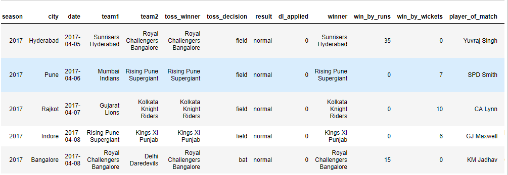
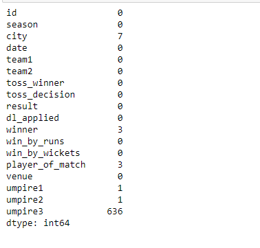
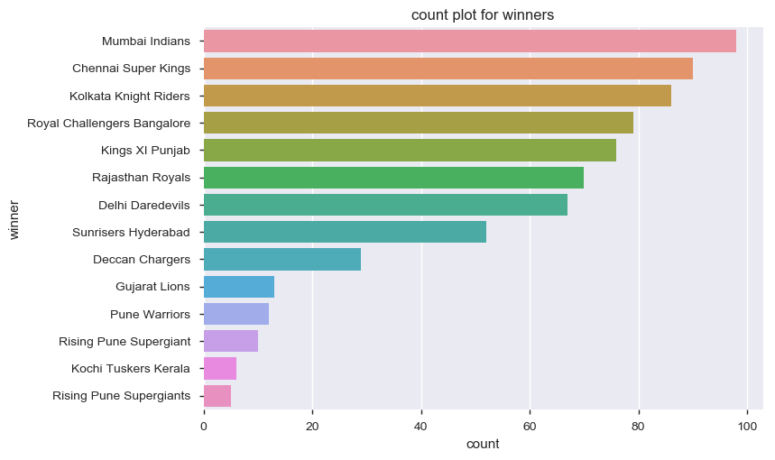
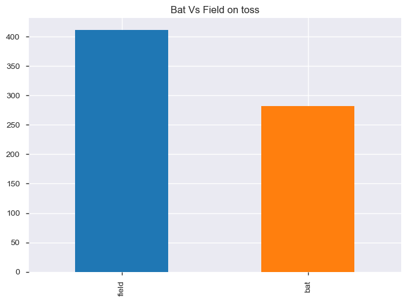
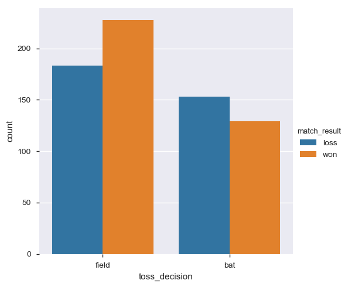
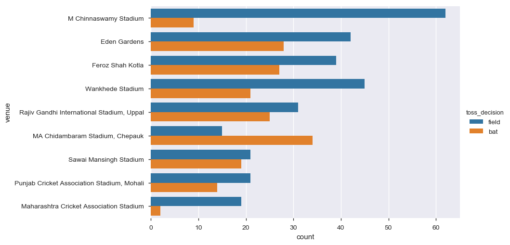
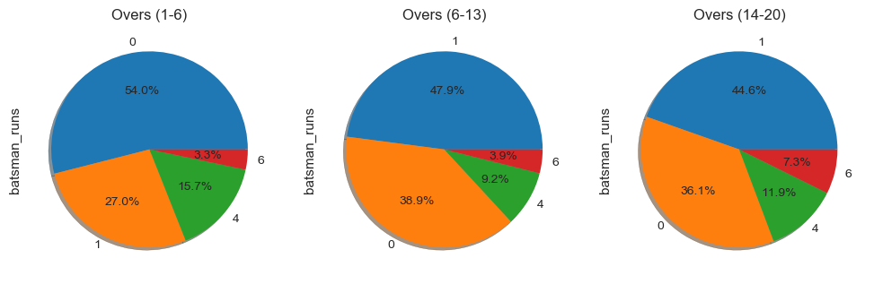
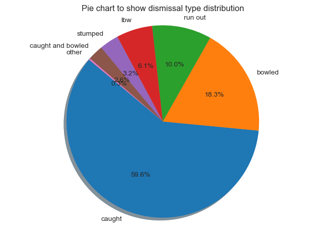
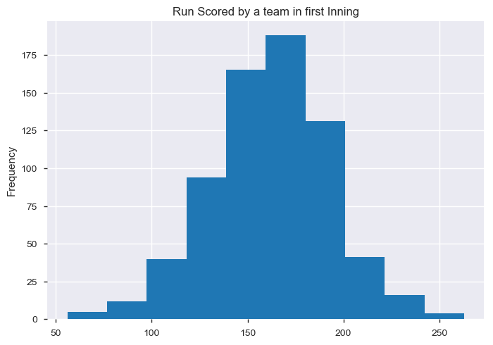

# Exploratory Data Analysis - IPL

## INTRODUCTION
The Indian Premier League __(IPL)__ is a professional Twenty20 cricket league in India contested during March or April and May of every year by eight teams representing eight different cities in India.
We will analyze macthes Data that includes abstract information about matches e.a. toss, venue, match result, umpire, toss decision.
Also We will analyze __Ball By Ball__ data to get insights of player wise statistics

## DATA
| Column Name | Description |
| --- | --- |
| `Season` | Year( 2008 - 2018 )|
| `Team1/Team2` | (Royal Challengers Bangalore, Rising Pune Supergiant, Kolkata Knight Riders, Kings XI Punjab, Delhi Daredevils, Sunrisers Hyderabad, Mumbai Indians, Chennai Super Kings, Rajasthan Royals )|
|`Result`| (Normal, Tie, No Result)|
|`toss_decision`|(bat, field)|
|`win_by_runs`| Numerical value |
|`win_by_wickets`|  Numerical value|
|`winner`| Winning Team Name |

## Project Analysis
| Description | Analysis |
| --- | --- |
| `matches.head` | 
| `Missing Values` | 

## Insights from Data
| Description | Plot |
| --- | --- |
|`Teams Winning Count`| |
|`Toss Decision`| |
|`Match Result Vs Toss Decision`| |
|`Stadium Vs Toss Decision`| |
|`Run Scored Distribution`| |
|`Dismissal Type Analysis`| |
|`Avergae Score on First Inning`| |

## Jupyter NoteBooks
* [Jupyter Notebook Matches](./EDA%20-%20IPL%20Matches.ipynb)
* [Jupyter Notebook Deliveries](./EDA%20-%20Deliveries%20-IPL.ipynb)

## Conclusion
* Mumbai Indian and Chennai Super Kings are top two teams.
* Toss winning team chooses Field mostly also chasing team has won better winning percentage.
* Victory margin ranges between 1-40 runs and 4-5 wickets.
* CH Gayle, AB de Villiers , Rohit Sharma are top players Won Man of the Match many times.

