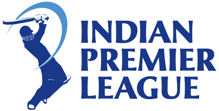

# Exploratory Data Analysis - IPL

## INTRODUCTION
The Indian Premier League __(IPL)__ is a professional Twenty20 cricket league in India contested during March or April and May of every year by eight teams representing eight different cities in India.
We will analyze macthes Data that includes abstract information about matches e.a. toss, venue, match result, umpire, toss decision.
Also We will analyze __Ball By Ball__ data to get insights of player wise statistics

## DATA
| Column Name | Description |
| --- | --- |
